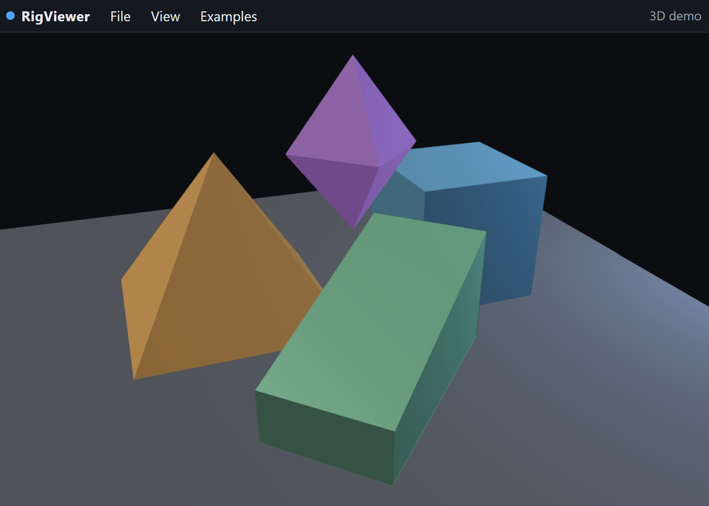

# RigViewer

Zero-setup viewer for [RigWorks](https://github.com/rigkid/RigWorks) documents. Browser chrome is **ImTui** (`web/tui/`) — the shared Viewer / [RigPlayer](https://github.com/rigkid/RigPlayer) shell (same immediate-mode grid as [vFont](https://github.com/GitBruno/vFont)). Windows dock (drag title to left / right / bottom), close with `[x]`, and reopen from **View**.

**Viewer presents; Player plays.** This repo is the Viewer — it presents POD (scene / GLSL sketch). It does **not** run document Lua. Playable `.rig` documents belong in [RigPlayer](https://github.com/rigkid/RigPlayer).

The `.json` files are **data**. The **scene preview** is this viewer (shapes drawn in a browser / desktop window).

## Preview the scene (right now)



[Open Scene Right Now](https://rigkid.github.io/RigViewer/)

```bash
cd D:\repos\RigViewer
npm run serve
```

Then open **http://127.0.0.1:8765/web/index.html** — it auto-loads the 3D demo (orbit with drag / scroll). Use **2D scene** for the orthographic specimen.

Or double-click [`dist/rigviewer.html`](dist/rigviewer.html) and use **Open** / drop a `.json` on the page (works offline).

Desktop:

```bash
desktop\build\bin\RigViewer.exe examples\minimal-scene.json
```

## Web viewer (zero install)

1. Open the hosted page: **`https://viewer.rig.works`** (preferred) or `https://<org>.github.io/RigViewer/` after Pages is enabled.
2. Or download [`dist/rigviewer.html`](dist/rigviewer.html) and double-click it — works offline.
3. Drag a Rig document onto the page, use **Open**, or pass `?src=<url>` (e.g. `?src=examples/demo-3d.json`).

```bash
# Local preview (serves web/ so ES modules resolve)
npx --yes serve web
# then open http://localhost:3000/?src=../examples/demo-3d.json
# or copy an example into web/ temporarily
```

Better local preview (serves repo root so examples resolve):

```bash
npx --yes serve .
# open /web/?src=/examples/demo-3d.json
```

Rebuild the single-file artifact after editing `web/`:

```bash
npm run vendor:three   # once, pins Three.js into web/vendor/
npm run bundle         # writes dist/rigviewer.html
npm test               # parser smoke over examples/
```

## Desktop app (RigKit)

See [desktop/README.md](desktop/README.md). Uses **rigDocumentShell** for File → Open and skipped-key honesty (shared with RigPlayer). Short path:

```bash
cmake -S desktop -B desktop/build -DRIGKIT_DIR=/path/to/RigKit
cmake --build desktop/build --config Release --target RigViewer
desktop/build/bin/RigViewer examples/minimal-scene.json
```

## What it draws

See **[docs/port-map.md](docs/port-map.md)** for the supported schema table (web vs desktop). Agent share flow: **[docs/ai-share.md](docs/ai-share.md)** · discovery index: [`llms.txt`](llms.txt).

Short version: Contract geometry (rectangle through mesh), transforms / parents / cameras, fill-stroke + solid paint, materials / lights, LFO + binding, UI panels, and `rig.media.code` (GLSL Shadertoy preview on web). Documents without an active camera use an orthographic 2D frame (Y-down). An active perspective camera switches to 3D orbit.

**Share a sketch:** **Copy link** builds a compact `?doc=` URL for small / creative-coding sketches. Soft and hard size limits show in the banner — when it gets out of hand, use **Save local** (`?local=1`) or host the JSON and use `?src=` (gist / git blob).

Optional desktop API HTML (requires [Doxygen](https://www.doxygen.nl/) on PATH):

```bash
npm run docs   # → docs/api/html/index.html
```

## Repo layout

| Path | Role |
|------|------|
| `web/` | Hosted Three.js viewer + ImTui chrome |
| `web/tui/` | Shared ImTui host (engine, dock, `rig.ui.*`) — Player vendors this folder |
| `dist/rigviewer.html` | Single-file offline viewer |
| `desktop/` | RigKit product app + Contract importer |
| `docs/` | Port map and product docs |
| `examples/` | Specimen Rig documents (from RigWorks) |
| `tools/` | Vendor / bundle / smoke tests |

## Publish / GitHub Pages

Remote: `rigkid/RigViewer` (branch `master`). Push when you want the host live — agents prepare commits locally only.

1. GitHub → **Settings → Pages → Build and deployment → Source: GitHub Actions**.
2. After a green `pages` workflow: `https://rigkid.github.io/RigViewer/` (and custom domain `viewer.rig.works` when DNS is ready).
3. The workflow deploys the viewer at site root **and** under `/web/`, plus `dist/rigviewer.html`, `examples/`, `llms.txt`, and key docs.

Emscripten / wasm of the desktop host is a separate RigKit issue — this repo keeps a lean JS viewer for the send-around case.

## License

MIT — see [LICENSE](LICENSE).

