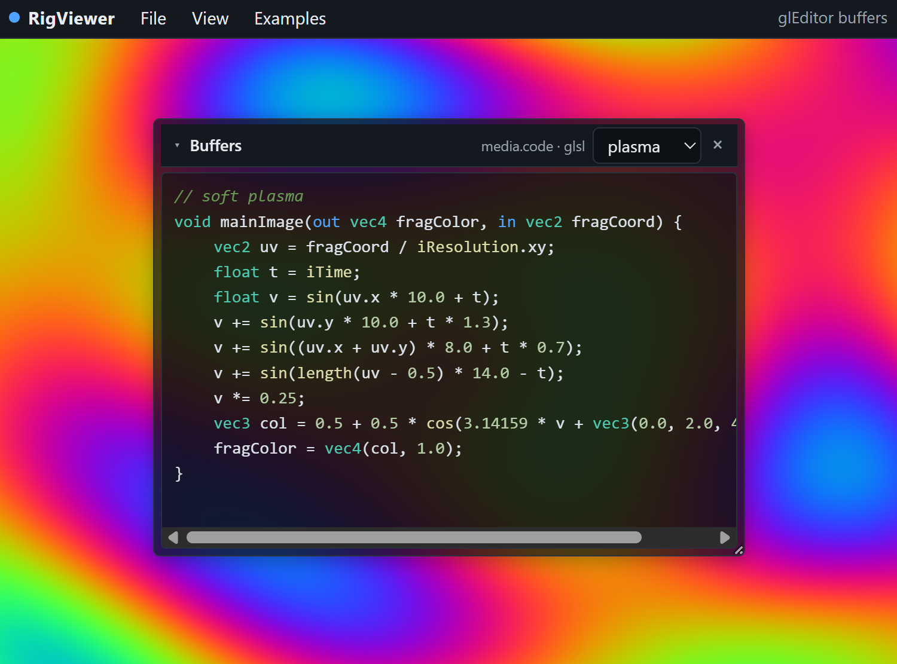

# Examples



Copies of [RigWorks](https://github.com/rigkid/RigWorks) example documents plus RigViewer demos for smoke tests and the hosted preview.

| File | Role |
|------|------|
| `minimal-scene.json` | 2D specimen + orthographic camera (pan/zoom) |
| `demo-3d.json` | Perspective camera, meshes, materials, lights (orbit) |
| `demo-gleditor.json` | `rig.media.code` GLSL buffers (gradient + plasma) shader preview + code editor |
| `lfo-binding.json` | LFO → transform binding |
| `ui-panel.json` / `portable-tool.json` | UI panel + paint.solid |

When RigWorks examples change meaningfully, re-copy shared ones:

```bash
cp ../RigKit/docs/contract/RigWorks/examples/*.json examples/
```

